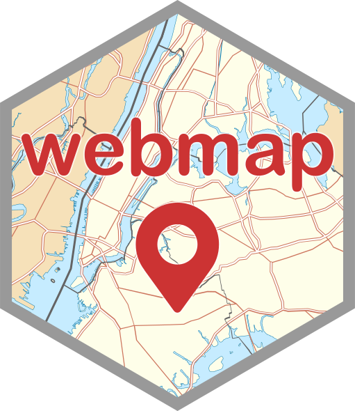
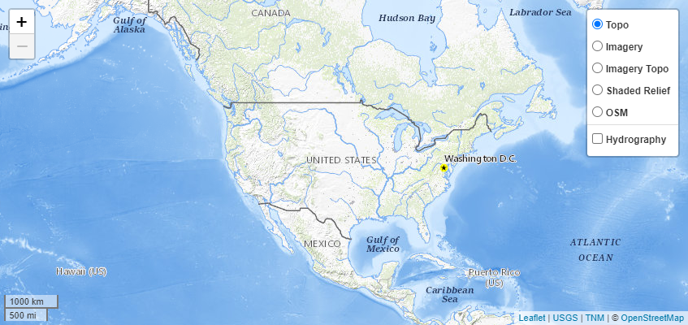

webmap 
==================================================================================

[](https://CRAN.R-project.org/package=webmap)
[](https://code.usgs.gov/inl/webmap/-/commits/main)
[](https://code.usgs.gov/inl/webmap/-/commits/main)

Description
-----------

The [R](https://www.r-project.org/) package **webmap** is a tool that
enables you to create interactive web maps using the JavaScript
[Leaflet](https://leafletjs.com/) library. It comes with base layers of
[The National
Map](https://www.usgs.gov/programs/national-geospatial-program/national-map)
(TNM), which provides access to geospatial information about the
landscape of the United States and its territories. However, it is
important to note that base layers outside these areas are unavailable
at higher spatial scales. The package is dependent on, and intended to
be used with, the [Leaflet for R](https://rstudio.github.io/leaflet/)
package. Additionally, the package includes various utility functions
that allow you to augment your web map with additional elements. You can
check the [TNM service status](https://stats.uptimerobot.com/gxzRZFARLZ)
to confirm that the service is operational.

Installation
------------

To install the current release of the package from
[CRAN](https://CRAN.R-project.org/package=webmap) you can use the
following command in R:

``` r
install.packages("webmap")
```

To install the package along with its dependencies, which are required
to run examples in the package help documentation, run:

``` r
install.packages("webmap", dependencies = TRUE)
```

To install the development version of the package, you need to clone the
repository and build from source, or run the following commands:

``` r
if (!requireNamespace("remotes")) install.packages("remotes")
remotes::install_gitlab(
  repo = "inl/webmap@develop",
  auth_token = Sys.getenv("GITLAB_PAT"),
  host = "code.usgs.gov",
  dependencies = TRUE
)
```

After installing the package, you can use it in various contexts,
including the R console, [R Markdown](https://rmarkdown.rstudio.com/)
documents, and [Shiny](https://shiny.posit.co/) applications.

Basic Usage
-----------

To create the default web map and display it (the screenshot below
showns the default web map), you can run the following commands:

``` r
library("webmap")
map <- make_map()
map
```

The screenshot below shows the default web map that is created by the
above commands.



Additional examples are provided in the package help pages. To access
these documents, run:

``` r
help(package = "webmap")
```

Authors
-------

-   Jason C. Fisher (ORCID iD
    [0000-0001-9032-8912](https://orcid.org/0000-0001-9032-8912))
-   Stefano Cudini ([leaflet-search
    library](https://github.com/stefanocudini/leaflet-search))
-   John Firebaugh ([Leaflet.fullscreen
    library](https://github.com/Leaflet/Leaflet.fullscreen))

Point of Contact
----------------

Jason C. Fisher
(<a href="mailto:jfisher@usgs.gov" class="email">jfisher@usgs.gov</a>)

Suggested Citation
------------------

To cite **webmap** in publications, please use:

Fisher, J.C., 2023, webmap—Interactive web maps using The National Map
(TNM) services: U.S. Geological Survey software release, R package,
Reston, Va.,
<a href="https://doi.org/10.5066/P9CPB1WD" class="uri">https://doi.org/10.5066/P9CPB1WD</a>.

Contributing
------------

We value your contributions and suggestions on how to make these
materials more useful to the community. Please feel free to share your
thoughts by commenting on the [issue
tracker](https://code.usgs.gov/inl/webmap/-/issues) or opening a [merge
request](https://code.usgs.gov/inl/webmap/-/merge_requests) to
contribute.

Code of Conduct
---------------

All contributions to- and interactions surrounding- this project will
abide by the [USGS Code of Scientific
Conduct](https://www.usgs.gov/office-of-science-quality-and-integrity/fundamental-science-practices).

<!-- Embedded References -->

Disclaimer
----------

This software is preliminary or provisional and is subject to revision.
It is being provided to meet the need for timely best science. The
software has not received final approval by the U.S. Geological Survey
(USGS). No warranty, expressed or implied, is made by the USGS or the
U.S. Government as to the functionality of the software and related
material nor shall the fact of release constitute any such warranty. The
software is provided on the condition that neither the USGS nor the U.S.
Government shall be held liable for any damages resulting from the
authorized or unauthorized use of the software.

Any use of trade, product, or firm names is for descriptive purposes
only and does not imply endorsement by the U.S. Government.

MIT License
-----------

Copyright (c) 2023, webmap authors

Permission is hereby granted, free of charge, to any person obtaining a
copy of this software and associated documentation files (the
“Software”), to deal in the Software without restriction, including
without limitation the rights to use, copy, modify, merge, publish,
distribute, sublicense, and/or sell copies of the Software, and to
permit persons to whom the Software is furnished to do so, subject to
the following conditions:

The above copyright notice and this permission notice shall be included
in all copies or substantial portions of the Software.

THE SOFTWARE IS PROVIDED “AS IS”, WITHOUT WARRANTY OF ANY KIND, EXPRESS
OR IMPLIED, INCLUDING BUT NOT LIMITED TO THE WARRANTIES OF
MERCHANTABILITY, FITNESS FOR A PARTICULAR PURPOSE AND NONINFRINGEMENT.
IN NO EVENT SHALL THE AUTHORS OR COPYRIGHT HOLDERS BE LIABLE FOR ANY
CLAIM, DAMAGES OR OTHER LIABILITY, WHETHER IN AN ACTION OF CONTRACT,
TORT OR OTHERWISE, ARISING FROM, OUT OF OR IN CONNECTION WITH THE
SOFTWARE OR THE USE OR OTHER DEALINGS IN THE SOFTWARE.

Support
-------

The Idaho National Laboratory Project Office of the USGS supports the
development and maintenance of **webmap**. Resources are available
primarily for maintenance and responding to user questions. Priorities
on the development of new features are determined by the development
team.

Additional Publication Details
------------------------------

Additional metadata about this publication, not found in other parts of
the page is in this table.

<!--html_preserve-->
<table>
<tbody>
<tr>
<th scope="row">
Publication type
</th>
<td>
Formal R language package
</td>
</tr>
<tr>
<th scope="row">
DOI
</th>
<td>
10.5066/P9CPB1WD
</td>
</tr>
<tr>
<th scope="row">
Year published
</th>
<td>
2023
</td>
</tr>
<tr>
<th scope="row">
Version
</th>
<td>
1.0.0
</td>
</tr>
<tr>
<th scope="row">
IPDS
</th>
<td>
IP-155090
</td>
</tr>
</tbody>
</table>

<cr><!--/html_preserve-->

<!-- Embedded References -->
